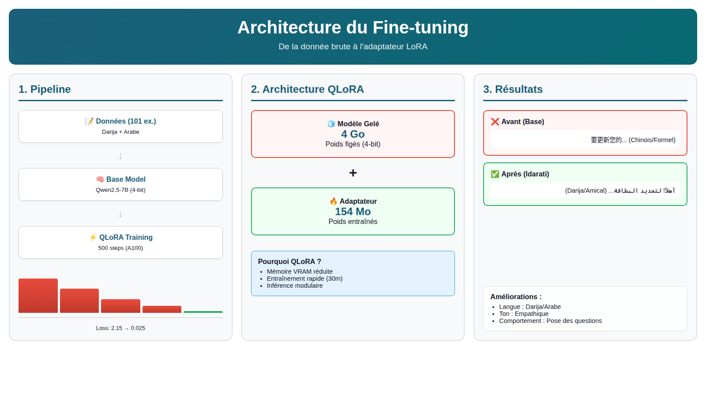
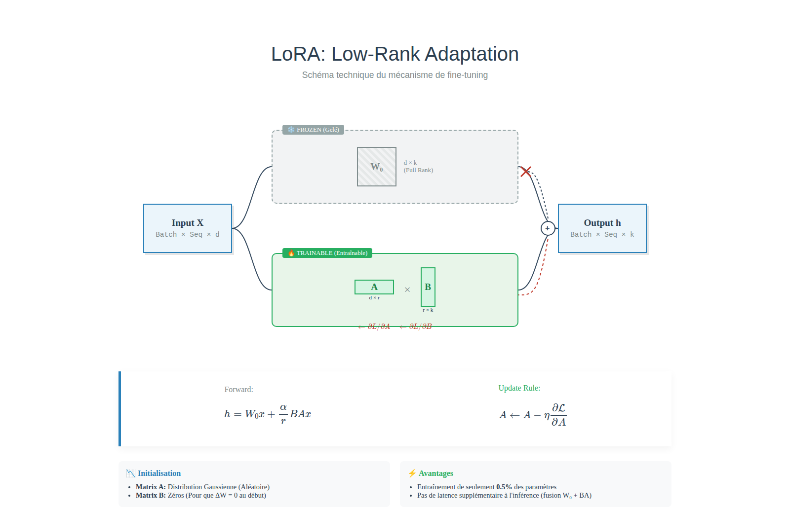

# Idarati Chatbot Finetuning Scripts

Fine-tuning pipeline for the **Idarati** Moroccan administrative chatbot using **QLoRA** on **Qwen2.5-7B-Instruct**. This repo focuses on data generation, validation, dataset splitting, and Modal-based training/inference scripts.

## Architecture (High-Level)



## QLoRA Deep Dive



## What’s Inside

- `src/finetuning/` — Data generation CLI, quality checks, and dataset splitting
- `src/modal/` — Modal training/inference scripts (A100 GPU)
- `docs/` — Mermaid diagrams and architecture notes
- `presentation/` — HTML diagrams + PDF presentation

## Quick Start

### 1. Install dependencies

```bash
pip install -r requirements.txt
```

### 2. Configure environment

Create a `.env` file (or set env vars):

```bash
cp .env.example .env
```

Required keys (depends on provider):
- `GEMINI_API_KEY` or `GEMINI_API_KEYS`
- `OPENROUTER_API_KEY`
- `MISTRAL_KEY` (for tone data generator)

### 3. Generate training data

```bash
python -m finetuning.cli generate input.json output.jsonl --model gemini-2.5-flash
```

### 4. Validate & split

```bash
python -m finetuning.cli validate output.jsonl
python -m finetuning.cli split output.jsonl --output-dir splits/
```

### 5. Modal training

```bash
# Edit modal config as needed
modal run src/modal/modal_train.py
```

## Notes

- Training data files and model checkpoints are excluded from git (`.gitignore`).
- The Modal scripts assume your LoRA adapter volume is configured.

## License

MIT
