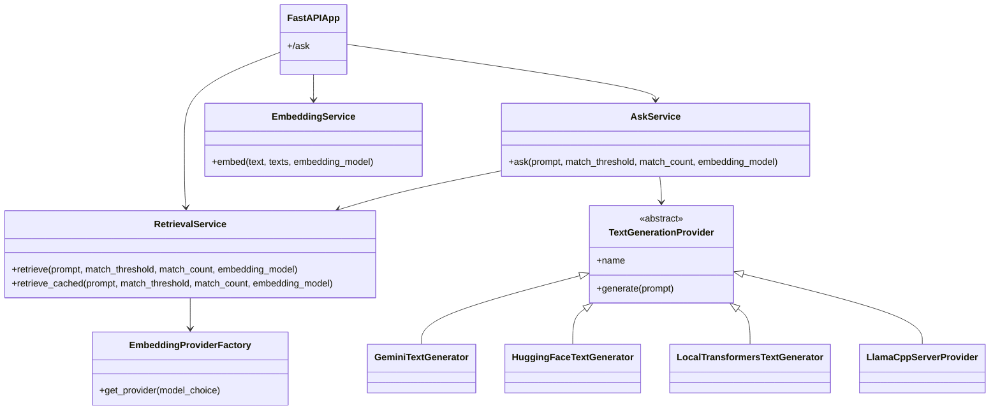

A class-style view of the FastAPI question flow, highlighting the main service objects and their responsibilities.

```mermaid
classDiagram
    class FastAPIApp {
        +/ask
    }

    class AskService {
        +ask(prompt, match_threshold, match_count, embedding_model)
    }

    class RetrievalService {
        +retrieve(prompt, match_threshold, match_count, embedding_model)
        +retrieve_cached(prompt, match_threshold, match_count, embedding_model)
    }

    class EmbeddingProviderFactory {
        +get_provider(model_choice)
    }

    class EmbeddingService {
        +embed(text, texts, embedding_model)
    }

    class TextGenerationProvider {
        <<abstract>>
        +name
        +generate(prompt)
    }

    class GeminiTextGenerator
    class HuggingFaceTextGenerator
    class LocalTransformersTextGenerator
    class LlamaCppServerProvider

    FastAPIApp --> AskService
    FastAPIApp --> RetrievalService
    FastAPIApp --> EmbeddingService
    AskService --> RetrievalService
    AskService --> TextGenerationProvider
    RetrievalService --> EmbeddingProviderFactory
    TextGenerationProvider <|-- GeminiTextGenerator
    TextGenerationProvider <|-- HuggingFaceTextGenerator
    TextGenerationProvider <|-- LocalTransformersTextGenerator
    TextGenerationProvider <|-- LlamaCppServerProvider
```
