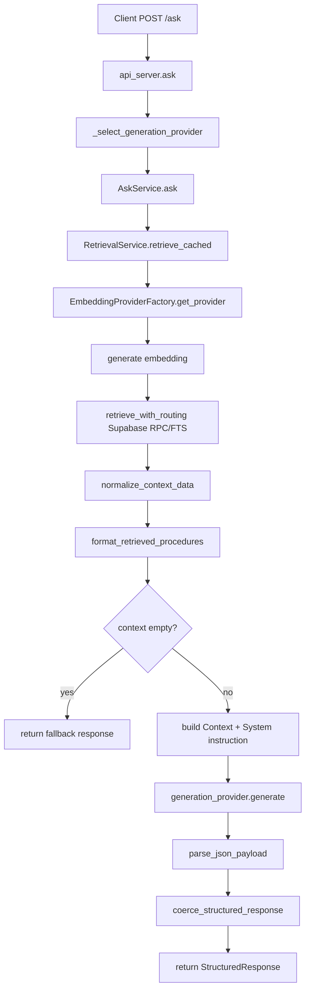

Flow of a user question through the FastAPI service (`/ask`) from request to structured response.

```mermaid
flowchart TD
    A[Client POST /ask] --> B[api_server.ask]
    B --> C[_select_generation_provider]
    C --> D[AskService.ask]
    D --> E[RetrievalService.retrieve_cached]
    E --> F[EmbeddingProviderFactory.get_provider]
    F --> G[generate embedding]
    G --> H[retrieve_with_routing Supabase RPC/FTS]
    H --> I[normalize_context_data]
    I --> J[format_retrieved_procedures]
    J --> K{context empty?}

    K -- yes --> L[return fallback response]
    K -- no --> M[build Context + System instruction]
    M --> N[generation_provider.generate]
    N --> O[parse_json_payload]
    O --> P[coerce_structured_response]
    P --> Q[return StructuredResponse]
```
