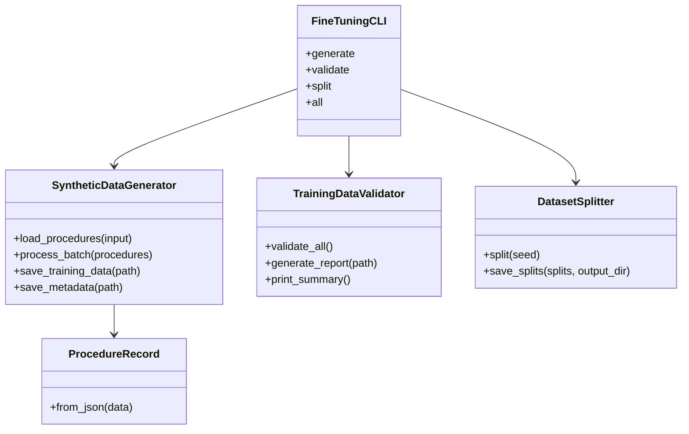

A class-style view of the fine-tuning data workflow components and their responsibilities.

```mermaid
classDiagram
    class FineTuningCLI {
        +generate
        +validate
        +split
        +all
    }

    class SyntheticDataGenerator {
        +load_procedures(input)
        +process_batch(procedures)
        +save_training_data(path)
        +save_metadata(path)
    }

    class ProcedureRecord {
        +from_json(data)
    }

    class TrainingDataValidator {
        +validate_all()
        +generate_report(path)
        +print_summary()
    }

    class DatasetSplitter {
        +split(seed)
        +save_splits(splits, output_dir)
    }

    FineTuningCLI --> SyntheticDataGenerator
    FineTuningCLI --> TrainingDataValidator
    FineTuningCLI --> DatasetSplitter
    SyntheticDataGenerator --> ProcedureRecord
```
