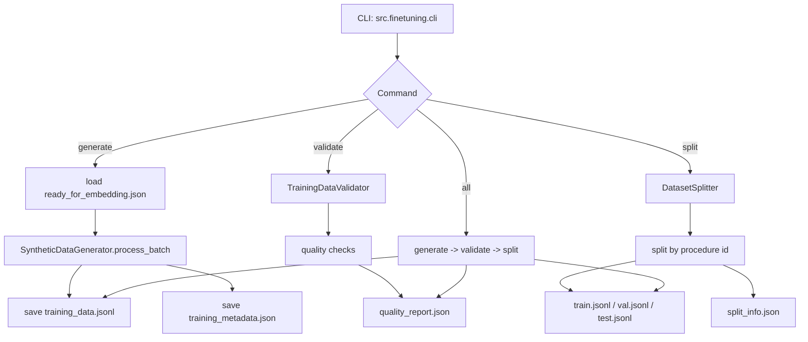

End-to-end flow of the fine-tuning data service from source procedures to train/val/test splits.

  

```mermaid

flowchart TD

    A[CLI: src.finetuning.cli] --> B{Command}

  

    B -->|generate| C[load ready_for_embedding.json]

    C --> D[SyntheticDataGenerator.process_batch]

    D --> E[save training_data.jsonl]

    D --> F[save training_metadata.json]

  

    B -->|validate| G[TrainingDataValidator]

    G --> H[quality checks]

    H --> I[quality_report.json]

  

    B -->|split| J[DatasetSplitter]

    J --> K[split by procedure id]

    K --> L[train.jsonl / val.jsonl / test.jsonl]

    K --> M[split_info.json]

  

    B -->|all| N[generate -> validate -> split]

    N --> E

    N --> I

    N --> L

```