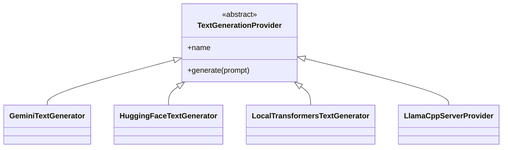

This highlights the OOP inheritance abstraction for text generation providers used during synthetic data generation and QA.

```mermaid
classDiagram
    class TextGenerationProvider {
        <<abstract>>
        +name
        +generate(prompt)
    }

    class GeminiTextGenerator
    class HuggingFaceTextGenerator
    class LocalTransformersTextGenerator
    class LlamaCppServerProvider

    TextGenerationProvider <|-- GeminiTextGenerator
    TextGenerationProvider <|-- HuggingFaceTextGenerator
    TextGenerationProvider <|-- LocalTransformersTextGenerator
    TextGenerationProvider <|-- LlamaCppServerProvider
```
