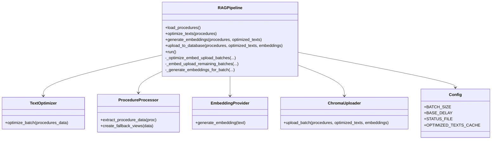

A class-style view of batching-related components in the RAG pipeline and their main responsibilities.

```mermaid
classDiagram
    class RAGPipeline {
        +load_procedures()
        +optimize_texts(procedures)
        +generate_embeddings(procedures, optimized_texts)
        +upload_to_database(procedures, optimized_texts, embeddings)
        +run()
        -_optimize_embed_upload_batches(...)
        -_embed_upload_remaining_batches(...)
        -_generate_embeddings_for_batch(...)
    }

    class TextOptimizer {
        +optimize_batch(procedures_data)
    }

    class ProcedureProcessor {
        +extract_procedure_data(proc)
        +create_fallback_views(data)
    }

    class EmbeddingProvider {
        +generate_embedding(text)
    }

    class ChromaUploader {
        +upload_batch(procedures, optimized_texts, embeddings)
    }

    class Config {
        +BATCH_SIZE
        +BASE_DELAY
        +STATUS_FILE
        +OPTIMIZED_TEXTS_CACHE
    }

    RAGPipeline --> TextOptimizer
    RAGPipeline --> ProcedureProcessor
    RAGPipeline --> EmbeddingProvider
    RAGPipeline --> ChromaUploader
    RAGPipeline --> Config
```
