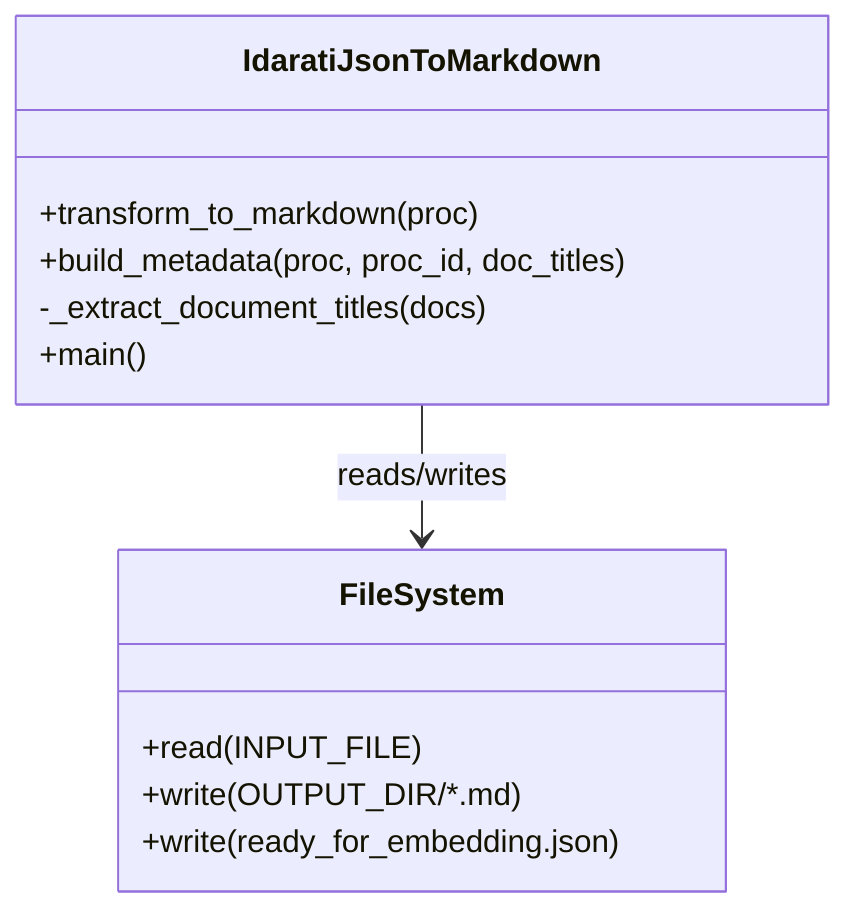

A class-style view of the functions used to convert Idarati JSON into Markdown and the embedding-ready records.

```mermaid
classDiagram
    class IdaratiJsonToMarkdown {
        +transform_to_markdown(proc)
        +build_metadata(proc, proc_id, doc_titles)
        -_extract_document_titles(docs)
        +main()
    }

    class FileSystem {
        +read(INPUT_FILE)
        +write(OUTPUT_DIR/*.md)
        +write(ready_for_embedding.json)
    }

    IdaratiJsonToMarkdown --> FileSystem : reads/writes
```
