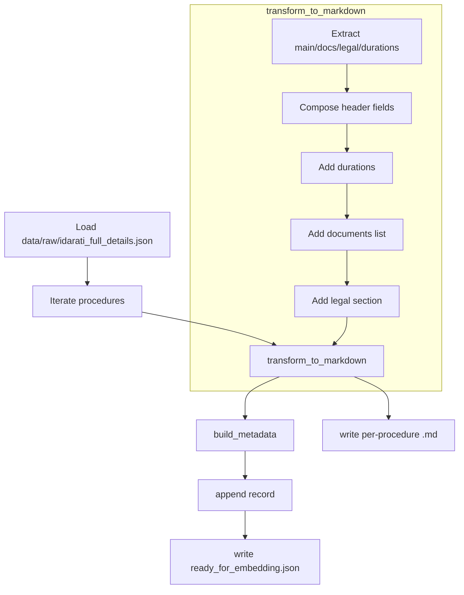

Flow of transforming Idarati API JSON into Markdown and the ready-for-embedding JSON bundle (`src/idarati_json_to_markdown.py`).

```mermaid
flowchart TD
    A[Load data/raw/idarati_full_details.json] --> B[Iterate procedures]
    B --> C[transform_to_markdown]
    C --> D[build_metadata]
    D --> E[append record]
    C --> F[write per-procedure .md]
    E --> G[write ready_for_embedding.json]

    subgraph transform_to_markdown
        C1[Extract main/docs/legal/durations] --> C2[Compose header fields]
        C2 --> C3[Add durations]
        C3 --> C4[Add documents list]
        C4 --> C5[Add legal section]
        C5 --> C
    end
```
