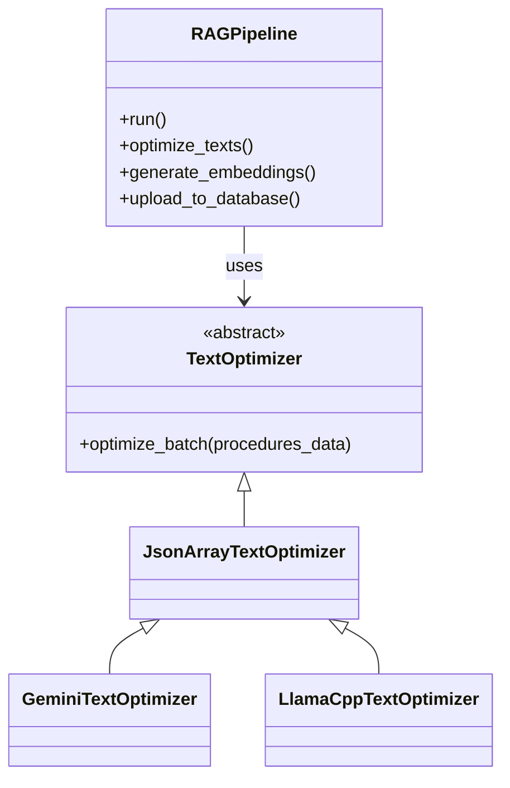

This highlights that `RAGPipeline` is not subclassed, but it composes an abstract optimizer hierarchy used inside the pipeline.

```mermaid
classDiagram
    class RAGPipeline {
        +run()
        +optimize_texts()
        +generate_embeddings()
        +upload_to_database()
    }

    class TextOptimizer {
        <<abstract>>
        +optimize_batch(procedures_data)
    }

    class JsonArrayTextOptimizer
    class GeminiTextOptimizer
    class LlamaCppTextOptimizer

    TextOptimizer <|-- JsonArrayTextOptimizer
    JsonArrayTextOptimizer <|-- GeminiTextOptimizer
    JsonArrayTextOptimizer <|-- LlamaCppTextOptimizer

    RAGPipeline --> TextOptimizer : uses
```
