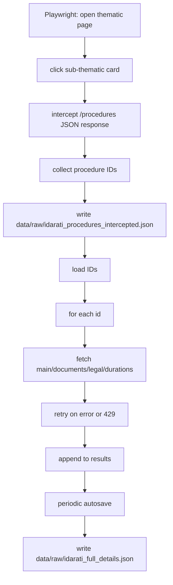

This captures the alternate Idarati API scraping flow that intercepts procedure IDs via Playwright and then fetches full details with retries (`src/idarati_collect_all_procedures_ids.py` + `src/idarati_collect_data_of_each_procedure.py`).

