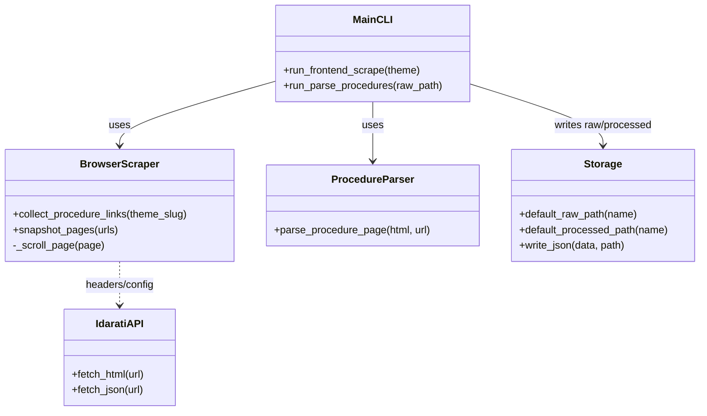

A class-style view of the main scraping-related modules and their responsibilities (shown as components with functions, even when implemented as standalone functions).

```mermaid
classDiagram
    class MainCLI {
        +run_frontend_scrape(theme)
        +run_parse_procedures(raw_path)
    }

    class BrowserScraper {
        +collect_procedure_links(theme_slug)
        +snapshot_pages(urls)
        -_scroll_page(page)
    }

    class IdaratiAPI {
        +fetch_html(url)
        +fetch_json(url)
    }

    class ProcedureParser {
        +parse_procedure_page(html, url)
    }

    class Storage {
        +default_raw_path(name)
        +default_processed_path(name)
        +write_json(data, path)
    }

    MainCLI --> BrowserScraper : uses
    MainCLI --> ProcedureParser : uses
    MainCLI --> Storage : writes raw/processed
    BrowserScraper ..> IdaratiAPI : headers/config
```
